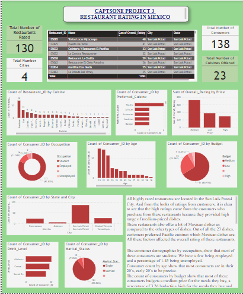
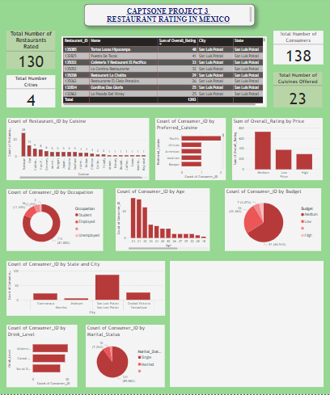
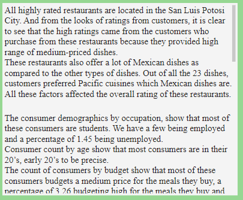
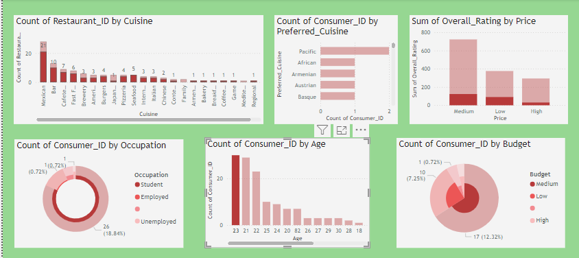

# Capstone Project 3

## Restaurant Rating In Mexico

---

### Introduction

This is a power bi project to analyze and draw out meaningful insights from the dataset which would help business entrepreneurs and investors in making more informed decisions

### Problem Statement

1. What can you learn from the highest rated restaurants? Do consumer preferences have an effect on ratings?
2. What are the consumer demographics? Does this indicate a bias in the data sample?
3. Are there any demand & supply gaps that you can exploit in the market?
4. If you were to invest in a restaurant, which characteristics would you be looking for?

### Skill/Concepts Demonstrated

The following skill/concept were incorporated:
- Power query

 Power Query
:-------------------------:

  
- Data cleaning
- Data modelling
- Data visualization

Transformed Table
:-------------------------:

### Data Sourcing

Digitately Drive (https://drive.google.com/file/d/1c1HKM8UTqwWOgexRLOtEJuxjBiA2N6xf/view?usp=drive_link) There are 5 tables and all were used in this analysis

### Data Modelling

Automatically derived relationships which can be adjusted to remove and replace unwanted relationships with the required. 5 tables;
- consumer preferences
- consumers
- ratings
- restaurant cuisines
- restaurants

### Visualisation

1 Page
   (https://docs.google.com/document/d/1_4ZXpp6TF8hDKUZ9ZnIze0WoMwDUQIhGYeLBhWvR6uk/edit?usp=drive_link)

The visuals report comprise of slicers, tables, cards, bar charts;
Pie Charts                 |    Cards                |   text box            |   Table
:-------------------------:|:-----------------------:|:---------------------:|:-------------------:
         |           |      | 

Bar charts            
:--------------------------------------:

Tables - 
These visuals display large amount of data for easily filtering for accurate results 

Pie charts -
A type of graph in which a circle is divided into sectors that each represent a proportion of the whole. These are normally used for easy distinctions

Cards - 
Display accurate numbers for the results against chosen slicers

Bar Charts - 
Provide changing but accurate results based off of values chosen in the slicers   

Text Box -
This one can type in findings from analyse data to give more clarity

Before filling text box| After filling text box
:---------------------:|:----------------------:
            |  

Model View
:---------------:

This model has a star schema

 ### Conclusion 

All highly rated restaurants are located in the San Luis Potosi City. And from the looks of ratings from customers, it is clear to see that the high ratings came from the customers who purchase from these restaurants because they provided high range of medium-priced dishes.These restaurants also offer a lot of Mexican dishes as compared to the other types of dishes. Out of all the 23 dishes, customers preferred Pacific cuisines which Mexican dishes are. All these factors affected the overall rating of these restaurants.

The consumer demographics by occupation, show that most of these consumers are students. We have a few being employed and a percentage of 1.45 being unemployed.
Consumer count by age show that most consumers are in their 20’s, early 20’s to be precise.  
The count of consumers by budget show that most of these consumers budgets a medium price for the meals they buy, a percentage of 3.26 budgeting high for the meals they buy and also a percentage of 25.36 budgeting low. 
Consumer count by state and city shows that most of these consumers are in the city and state of San Luis Potosi. So here I would say there is a bias here because the highly rated restaurants here are from San Luis Potosi, where most the consumer demographic for this analysis. There is also a bias since most of these consumers are in their 20s are students. 

Exploiting the age difference of consumers would be a game changer being that most of the consumers in this dataset are their 20s. And most, if not all are schooling that means they have low budget when it comes to food since their money is being used for other things mostly education. I would supply them with meals with low prices so that they can afford it and then patronize my restaurant more if it was one of these restaurants. 

 ###  Recommendation

If I wanted to invest in a restaurant business in a city, I would first look at the areas. Is the area filled with companies and schools. I would also look at the age range of my possible consumers and their occupation. If we have high student rate and a high employent rate, that means there's a strong possibility these categories will become regular patrons of my restaurant. Since students and employees live fast life, they would also look for fast means to eat so as to get back to business. I would also look around to see whether they are companies around. This is because there is a possible that their employees would stop at my restaurants for lunch breaks. I'm assured that I would get patrons on a regular. I will also look into the preferred cuisine of the people around by ask and do my research to get to know what they would like; I will also look at the preferred price range of my food. If I'm dealing with students, I would have low price ranges on food for these students and with workers would have medium to high price ranges for my food. I would also look at the marital status of the consumers are in the city. Being that if we have a percentage of single people in that place, I know for sure that patronage is going to be up, But in the case, where we have a large group of married people in that space, patronage will be low because married people will tend to cook their own meals at home. 
