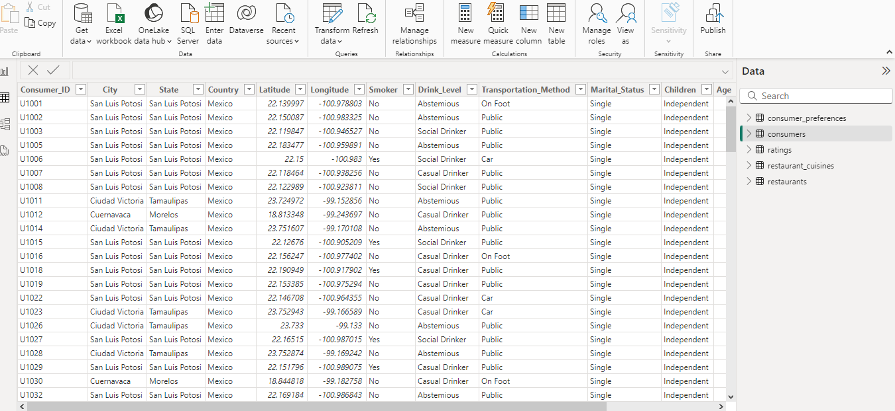

# Capstone Project 3

## Restuarant Rating In Mexico

---

### Introduction

This is a power bi project to analyze and draw out meaningful insights from the dataset which would help business entrepreneurs and investors in making more informed decisions

### Problem Statement

1. What can you learn from the highest rated restaurants? Do consumer preferences have an effect on ratings?
2. What are the consumer demographics? Does this indicate a bias in the data sample?
3. Are there any demand & supply gaps that you can exploit in the market?
4. If you were to invest in a restaurant, which characteristics would you be looking for?

### Skill/Concepts Demonstrated

The following skill/concept were incorporated:
- Power query

 Power Query
:-------------------------:

  
- Data cleaning
- Data modelling
- Data visualization

Transformed Table
:-------------------------:

### Data Sourcing

Digitately Drive (https://drive.google.com/file/d/1c1HKM8UTqwWOgexRLOtEJuxjBiA2N6xf/view?usp=drive_link) There are 5 tables and all were used in this analysis

### Data Modelling

Automatically derived relationships which can be adjusted to remove and replace unwanted relationships with the required.

### Visualisation

The visuals report comprise of slicers, tables, cards, bar charts;
Pie Charts                 |    Cards                |   text box            |   Table
:-------------------------:|:-----------------------:|:---------------------:|:-------------------:
         |           |      | 

Bar charts            
:--------------------------------------:

Tables - 
These visuals display large amount of data for easily filtering for accurate results 

Pie charts -
A type of graph in which a circle is divided into sectors that each represent a proportion of the whole. These are normally used for easy distinctions

Cards - 
Display accurate numbers for the results against chosen slicers

Bar Charts - 
Provide changing but accurate results based off of values chosen in the slicers   

Text Box -
This one can type in findings from analyse data to give more clarity

Model View
:---------------:

This model has a star schema

### Visualisation 

1. Page 1
   (insert link here do not forget)

!
